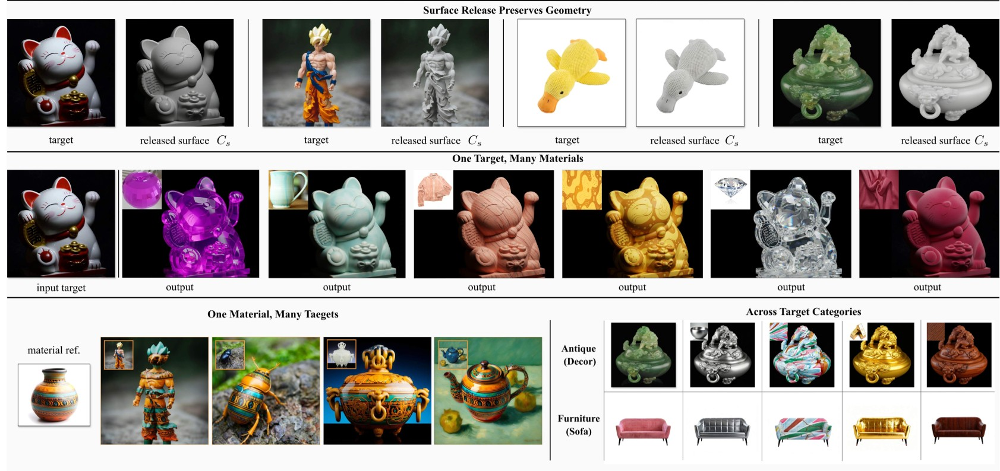
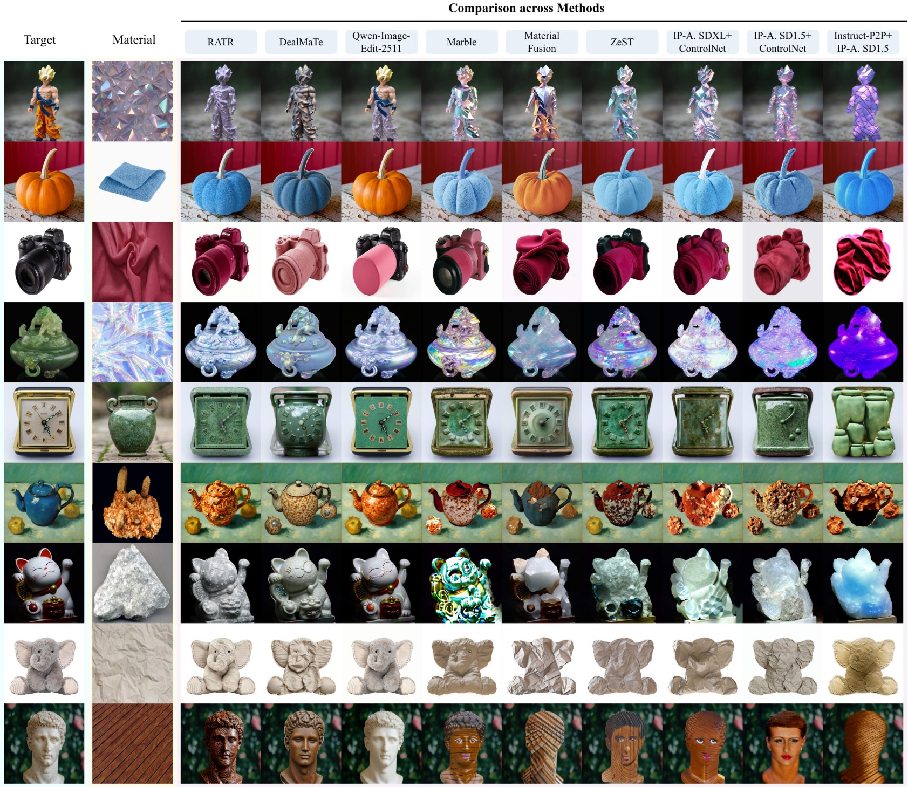

# RATR

<p align="center">
  <b>RATR: Training-Free Material Rebinding with Role-Aware Target–Reference Conditioning</b>
</p>

<p align="center">
  Official project page for <b>RATR</b>.
</p>

<p align="center">
  <b>Paper Coming Soon</b> &nbsp;|&nbsp;
  <b>Code Coming Soon</b>
</p>

<p align="center">
  
</p>

---

## Overview

**RATR** is a training-free material rebinding framework built upon a frozen two-image editor. It reorganizes the target image and material reference into role-specific visual conditions before generation, aiming to preserve the geometry and identity of the target object while transferring the visible material appearance of the reference. This repository serves as the project page and result gallery, with more qualitative results, comparisons, ablations, and implementation details to be added progressively.

---

## Qualitative Comparison

<p align="center">
  
</p>


---


## Citation

BibTeX will be added upon publication.

```bibtex
@article{ratr,
  title   = {RATR},
  author  = {Anonymous},
  journal = {Under Review},
  year    = {2026}
}
